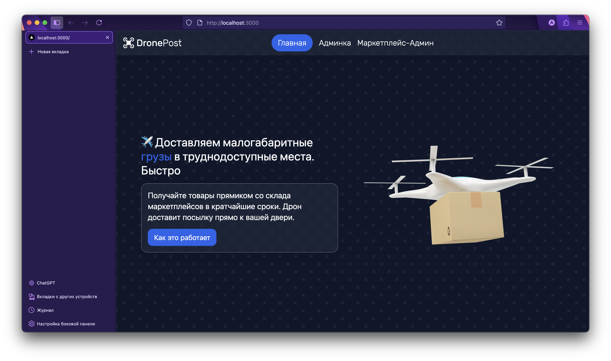
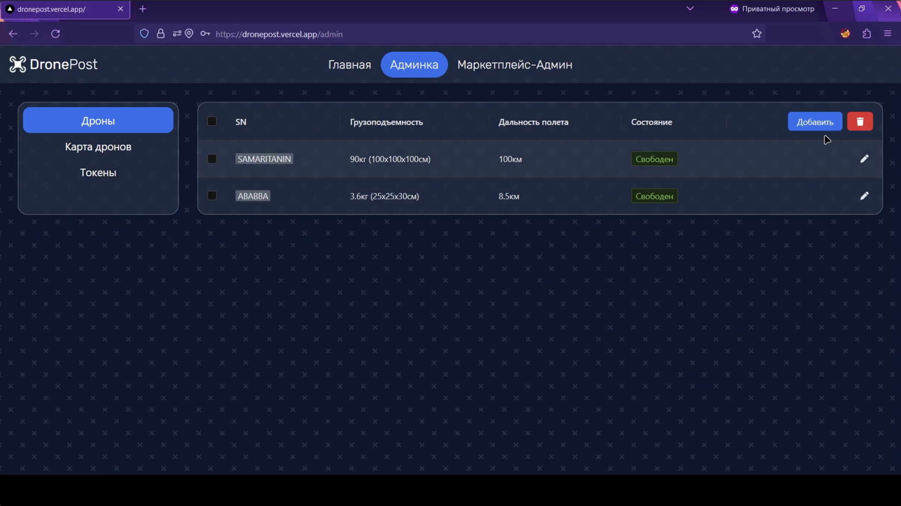

# 🚁 DronePost Frontend

Фронтенд для системы доставки грузов дронами.

## Что это и зачем нужно

В рамках хакатона от Sitronics в октябре 2023 года надо было за пару дней разработать систему доставки грузов дронами.
ТЗ было максимально размытое, а во время промежуточных отчетов приоритеты менялись в зависимости от жюри: то важен
интерфейс, то адаптивность, то только функционал, то самым главным был бизнес-план.

Я на том ивенте взял на себя роль фронтендера и сделал максимально красиво, насколько хватило умений. Исходники от бэка
и легендарный `pipeline.sh` оказались утеряны, хотя может у кого из команды и остались.

Если вы хотите сделать свой сервис доставки грузов дронами, то предлагаю отказаться от данной идеи, так как в РФ
отсутствует необходимая инфраструктура для автономных полетов, а получение разрешений и лоббирования потребуют слишком
много времени и средств. Если вы Газпром, то скажу по-другому: "это тупо невыгодно, если использовать существующих вендоров".

## Видео работы сервиса

\*Клик\*
